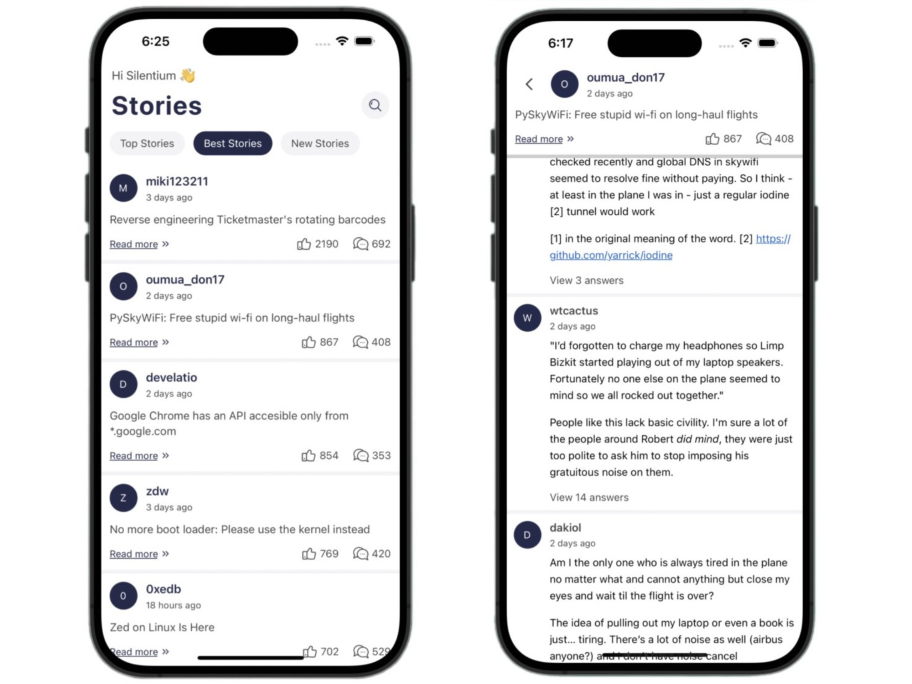

# <h1 id='top' align="center">Welcome to Silentium Test 👋</h1>

## Table of Contents

- [Introduction](#introduction)
- [Download](#download)
- [Prerequisites](#prerequisites)
- [Installation](#installation)
- [Running the App](#running-the-app)
- [Troubleshooting](#troubleshooting)
- [Contact](#-contact)

## Introduction



- View new/best/top stories on the screen
- View details and comments for each post in the list.

## Download

You can download demo for android platform here:

<div>
    <a href="https://drive.google.com/file/d/1fNk5I1QV3pYhE0yrDQx4i_-BKvSetoVl/view?usp=sharing" download="app-release" >
        
    </a>
</div>

## Prerequisites

Before you begin, ensure you have the following installed on your system:

- [Node.js](https://nodejs.org/) (v12 or later)
- [npm](https://www.npmjs.com/) or [yarn](https://yarnpkg.com/)
- [Git](https://git-scm.com/)
- [React Native CLI](https://reactnative.dev/docs/environment-setup)
- [Xcode](https://developer.apple.com/xcode/) (for iOS development)
- [Android Studio](https://developer.android.com/studio) (for Android development)

## Installation

Follow these steps to get the development environment running.

### Clone the repository

```sh
git clone https://github.com/fishryanie/SilentiumTest
```

### Install package

```javascript
yarn
```

Or

```javascript
npm install
```

#### Platform IOS install Pods
```javascript
cd ios && pod-install && cd ..
```
Or apple silicon
```javascript
yarn pod-install:apple-silicon
```

### Running the App

#### Run the iOS app

```javascript
yarn ios
```

#### Run the Android app

```javascript
yarn android
```

## Troubleshooting

If you encounter issues, consider the following steps:

- Ensure all prerequisites are installed correctly.
- Verify that your emulators or devices are properly set up.
- Check for any error messages in the terminal and follow the suggested solutions.

## Contact

If you have any questions or feedback, please feel free to contact us at:

- Email: [qphanquan1998@gmail.com](qphanquan1998@gmail.com)
- GitHub: [https://github.com/fishryanie](https://github.com/fishryanie)

<p align="right">(<a href="#top">back to top</a>)</p>
